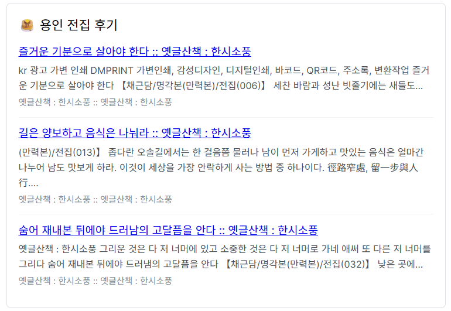

# 1. Mockup

## 1.1 데이터

기존 3개 도시(서울/수원/부산)를 10개(제주/대전/광주/대구/강릉/인천/울산 추가)로 늘렸다. 각 도시에 최저기온(min), 최고기온(max) 필드도 추가했고, 날씨 상태(status)도 맑음/비 2종류에서 날씨앱을 참고해 4종류로 늘렸다.

## 1.2 v-if 조건 변경

온도 25도 기준으로 더움/선선함 구분하던 조건을 status와 min(최저기온)을 보는 조건들로 변경했다.

```html
<span v-if="item.status === '비'" class="badge rain">☔ 우산 챙기세요</span>
<span v-else-if="item.min >= 25" class="badge tropical">🌙 열대야 조심</span>
<span v-else-if="item.status === '맑음'" class="badge sunny">☀️ 맑음</span>
```

## 1.3 카드 밖 클릭하면 초기화

날씨 카드 누르면 상태바에 도시명 뜨는 기능이 있는데, 검색창이나 빈 공간처럼 카드 아닌 곳을 누르면 다시 초기 문구로 돌아가는 기능을 추가했다. 제일 바깥 'dashboard-wrapper'에 클릭 이벤트를 걸고, 카드 클릭에는 '.stop'이 없으면 바로 초기화 문구로 덮어써버려서 '.stop'을 붙였다.

## 1.4 트러블슈팅: 파일명 변경 후 import 깨짐

파일명을 실습 순서를 붙여 '01-WeatherMockup.vue'로 바꾸려 했는데, VS Code가 자동으로 import 경로도 고쳐주며 'WeatherMockup.vue/index.js'라는 잘못된 경로로 바꿔줬다. 게다가 이 깨진 import가 'App.vue'가 아니라 'HomeView.vue'에 있어서 한참 헤매다, 에러 메시지에 찍힌 파일 경로를 찾아서 수정치니 정상 작동했다.

# 2. Composition

## 2.1 검색 필터링 (computed)

타이핑할 때마다 직접 리스트를 걸러내는 대신, computed로 검색어에 맞는 도시만 자동으로 다시 계산되도록 작성했다. 검색 결과가 하나도 없으면 안내 문구를 따로 띄운다.

```js
const filteredWeatherList = computed(() => {
  const query = searchQuery.value.trim()
  if (!query) {
    return weatherList.value
  }
  return weatherList.value.filter((item) => item.name.includes(query))
})
```

## 2.2 상태 감시 (watch, watchEffect)

selectedCityInfo(상태바 문구)는 watch로, searchQuery(검색어)는 watchEffect로 감시해서 값이 바뀔 때마다 콘솔에 로그를 남기게 했다.

## 2.3 정렬 기능 (본인 추가 기능)

이름순/온도순으로 바꿀 수 있는 정렬 토글 버튼을 추가했다. sortOrder 상태를 두고, 검색으로 걸러진 리스트를 정렬 기준에 맞게 다시 정렬해서 화면에 보여준다.

```js
const sortedWeatherList = computed(() => {
  const list = [...filteredWeatherList.value]
  return sortOrder.value === 'temp'
    ? list.sort((a, b) => b.temp - a.temp)
    : list.sort((a, b) => a.name.localeCompare(b.name))
})
```

# 3. Components

## 3.1 파일 분할 구조

한 파일에 있던 마크업을 부모 1개와 자식 4개로 분리했다. 데이터와 상태('weatherList', 'searchQuery', 'selectedCityInfo', 'sortOrder', 'currentPage')는 부모가 소유하고, 자식은 props로 값을 전달받아 표시하며 사용자 동작은 emit으로 부모에 전달한다(props down / events up).

- '03-WetherParent.vue' : 데이터/상태/computed/watch를 소유하는 부모 컨테이너
- '03-SearchBar.vue' : 검색어 입력과 정렬 토글 담당. 'searchQuery', 'sortOrder'를 받아 'update:searchQuery', 'toggle-sort'를 emit
- '03-WeatherCard.vue' : 날씨 카드 1건 표시. 'item'을 받아 뱃지 조건을 처리하고 'select', 'detail'을 emit
- '03-BaseDashboardCard.vue' : 카드형 레이아웃 공용 컴포넌트
- '03-Pagination.vue' : 본인 추가 컴포넌트 (아래 3.2)

## 3.2 페이지네이션 (본인 추가 컴포넌트)

도시가 10개로 늘어나면서 카드가 한 화면에 모두 나열되어 가독성이 떨어지고 심미성이 떨어졌다. 이를 개선하기 위해 한 페이지에 4개('pageSize')씩만 표시하고 페이지를 넘겨볼 수 있는 'Pagination' 컴포넌트를 추가했다.

리스트를 자르는 계산은 부모가 담당하고, 이 컴포넌트는 이전/다음/페이지 번호 버튼 UI만 담당한다. 'currentPage', 'totalPages'를 props로 받고, 페이지 이동은 'update:currentPage'로 emit한다.

검색어나 정렬 기준이 바뀌면 결과 수가 줄어 빈 페이지가 표시될 수 있어, watch로 'currentPage'를 1로 초기화하도록 처리했다.

# 4. Router

## 4.1 상세 페이지 갱신 처리

'/weather/:cityId'에서 도시만 바뀔 때는 같은 컴포넌트가 재사용되어 'onMounted'가 다시 호출되지 않는다는 걸 확인했다. 그래서 'route.params.cityId'를 watch해서 도시가 바뀔 때마다 데이터를 다시 찾아오도록 처리했다.

## 4.2 공용 Mock Data ('src/data/04-cities.js')

홈 화면과 상세 화면이 같은 도시 데이터를 써야 해서 인라인 배열을 모듈로 분리하고, 상세 화면에 필요한 습도/풍속/강수확률/기압 항목을 추가했다.

## 4.3 04-WeatherStatsView.vue (본인 추가 view)

공용 Mock Data를 computed로 집계해서 전체 도시 수, 평균 기온, 최고/최저 기온 도시, 날씨 상태(맑음/비/구름많음/흐림)별 도시 수 분포를 보여준다.

최고 기온 도시와 최저 기온 도시는 이름을 클릭하면 해당 도시의 상세 페이지로 바로 이동하도록 만들어서, 단순히 숫자만 나열하는 통계 화면이 아니라 다른 화면과 연결되게 했다.

# 5. Store

## 5.0 파일명 리팩토링

실습 과정을 진행하면서 편의상 파일명에 실습 순서를 붙인 '01-' ~ '04-' 프리픽스가 존재했다. 그런데 파일 수정 시 버전 관리가 어렵고 import 등에 불편함이 생겨 이번 실습 진행 전 제거하는 방향으로 리팩토링했다.

## 5.1 온도 단위 전환 (configStore)

'unit'(섭씨/화씨) state, 'unitSymbol' getter, 'toggleUnit' action을 두고 네비게이션 바 옆 'UnitToggler'로 전환한다. 목록과 상세는 'formatTemp()'로 단위에 맞춰 기온을 변환해 보여주고, 뱃지 조건은 섭씨 기준을 유지했다.

## 5.2 최근 본 도시 (본인 추가 recentStore)

상세 페이지에 들어갈 때마다 조회한 도시를 'recentStore'에 쌓아, 홈 상단에 '최근 본 도시' 섹션으로 보여준다. 상태 'recentCityIds'에 도시 id를 최신순으로 담고, action 'addRecentView'는 중복 id를 맨 앞으로 당기며 최대 5개까지만 유지하도록 구현했다.

'WeatherDetailView'의 'loadCity()'에서 'addRecentView'를 호출하고, 홈에서는 도시명을 누르면 'RouterLink'로 해당 상세 페이지로 이동한다.

## 6.0 아이디어와 진행 방식

비 오는 날씨 카드를 보다가, 비 오는 지역을 알려주고 해당 지역의 전집을 검색해 보여주는 기능을 구현해보기로 했다. 5번까지는 최대한 직접 코드를 작성하다 보니 시간이 부족했고, 지도 시각화와 외부 API 연동까지 범위가 커지면서 이 방식으로는 시간이 오래 걸릴 것으로 판단해 6번부터는 코드 제너레이션을 적극 활용했다. 다만 결과를 그대로 받아쓰지 않고, 구조와 이유를 직접 질문하며 이해한 뒤 반영했다.

## 6.1 API 연동 히스토리

맛집 검색은 처음에 카카오 로컬 API로 구현했다. 로컬 환경에서는 정상 동작했으나 Vercel 배포 후에는 호출이 실패했다. 서버리스 프록시 방식으로 전환하면 해결될 것으로 예상하고 시도했으나, 이 역시 호출에 실패했다.

여러 방법을 시도했음에도 해결되지 않아, 최종적으로 네이버 검색 API로 전환했다. 브라우저에서 직접 호출할 경우 CORS 문제가 발생해, Vercel 서버리스 함수를 통해 호출하는 방식으로 구현하고자 했다.

## 6.2 API 트러블슈팅

네이버로 전환한 이후에도 계속 인증 오류가 발생했다. 원인을 확인해보니, 네이버 검색 API가 최근 네이버 클라우드 플랫폼 쪽으로 이관되면서 호출 엔드포인트와 인증 헤더 방식이 변경되어 있었다. 기존 방식으로 호출하고 있던 것이 원인이었고, 변경된 방식에 맞게 수정한 뒤 정상적으로 연동됐다.



또한 검색 키워드를 '{도시} 전집'으로 설정했더니, 음식점이 아니라 고전 문학 전집류의 블로그 글이 검색되는 문제가 있었다. 여러 키워드를 시도해본 끝에, 검색 키워드를 '{도시} 모듬전 파전 맛집'으로 변경해 실제 음식점 후기가 검색되도록 했다.

## 6.3 최종 구현 요약

수도권 시군구 지도를 GeoJSON과 D3로 렌더링하고, 대표 도시 8곳의 실시간 날씨를 OpenWeatherMap으로 조회해 비 오는 지역을 표시했다. 하루 한 번만 API를 호출하도록 날짜 기준 캐싱을 적용했으며, 지도나 카드를 클릭하면 상세 페이지에서 날씨 정보와 전집 후기 블로그 글 상위 3건을 확인할 수 있다.

지도를 렌더링하는 과정에서 투영 방식 관련 문제를 겪었다. 구면 투영을 적용하니 각 시군구 영역이 반전되어 표시되는 문제가 있었는데, 수도권처럼 좁은 범위에서는 왜곡이 무시할 수준이라 판단해 평면 투영 방식으로 변경해 해결했다.

# 7. UI Libraries

## 7.0 라이브러리 선정 이유

Element Plus를 선택했다. Vue 3 Composition API를 정식 지원하고 한글 자료가 풍부해, 처음 다뤄보는 라이브러리를 빠르게 적용하기에 적합하다고 판단했다.

## 7.1 적용 범위

기존 컴포넌트 전체를 교체하기보다, 온도 단위 토글 버튼을 스위치 컴포넌트로, 대표 도시 카드를 카드 컴포넌트로 바꾸는 정도로 적용 범위를 제한했다.

## 7.2 트러블슈팅

처음에는 전역 등록 방식으로 적용했는데, 실제 사용하는 컴포넌트는 두 개뿐임에도 빌드 결과물 용량이 크게 증가했다. 필요한 컴포넌트만 개별로 불러오는 방식으로 변경해 해결했다.

스토어에 저장된 온도 단위 값은 문자열 타입이고 스위치 컴포넌트는 불리언 값을 다루기 때문에 타입이 맞지 않았는데, 둘을 변환해주는 계산된 속성(computed)을 두어 연결했다.

# 8. Vite Build and Deployment

## 8.0 진행 순서

수업을 모두 들은 뒤 6번부터의 과정을 시작했기 때문에, 처음부터 API 키를 환경 변수 파일에 저장하고 .gitignore 목록에 등록한 상태로 진행했다.

## 8.1 소스 코드 품질 관리

ESLint 점검을 통해 에러가 없는 상태임을 확인했다. API 키는 환경 변수로 분리했으며, 실제 값이 담긴 파일은 깃 무시 목록에 포함시켜 저장소에는 예시 파일만 커밋했다.

키는 노출 범위에 따라 구분해 관리했다. OpenWeatherMap 키는 브라우저에서 직접 호출하므로 클라이언트 코드에 포함되며, 네이버 키는 서버리스 함수에서만 사용되도록 별도 접두사로 분리했다.

## 8.2 빌드와 배포

빌드를 진행해 정적 파일이 정상적으로 생성되는 것을 확인했고, Vercel을 통해 배포했다. 배포 주소는 다음과 같다.

https://skala-vue-p068.vercel.app

시크릿 창으로 접속해 로그인 없이 정상적으로 표시되는 것까지 확인했다.

# 9. 배운 점

Vue는 처음 접하는 프레임워크라 낯설었지만, 실습을 진행하면서 흥미롭게 배울 수 있었다.

특히 API 연동 과정에서 여러 번 막히면서, 공식 문서와 명세를 정확히 확인하는 것이 구현 자체보다 우선이라는 점을 다시 느꼈다. 예상과 다르게 동작할 때마다 원인은 대부분 코드가 아니라 본인이 놓친 규칙이나 변경 사항에 있었기 때문이다.

시간 관계상 모든 코드를 직접 작성하지는 못했지만, 프론트엔드 프레임워크의 작동 원리를 살펴보고 활용해볼 수 있었던 좋은 기회였다고 생각한다.
